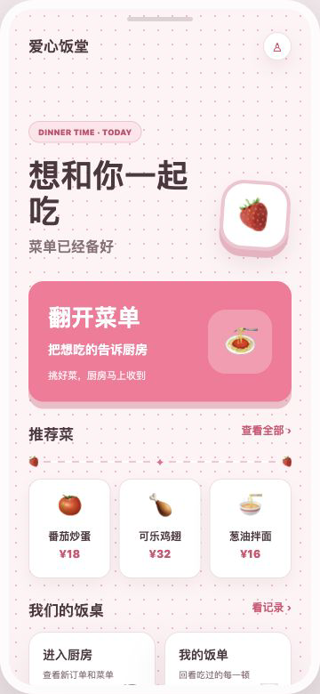
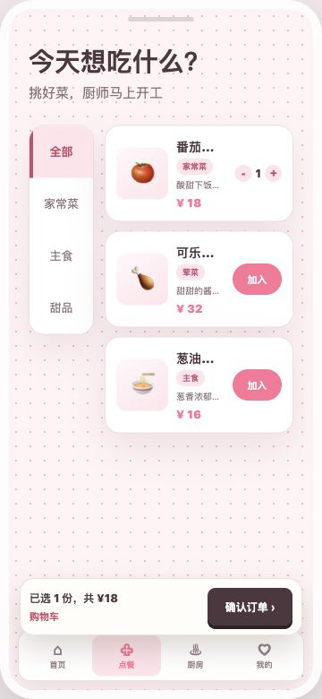
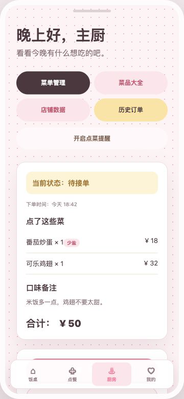

# 情侣私厨点餐小程序

把“今晚吃什么”变成两个人一起完成的小事。

这是一个基于微信小程序原生框架和微信云开发的双人点餐工具：一方点菜，一方掌勺；从情侣绑定、菜单管理、下单接单，到完成评价和月度报告，形成一条轻量但完整的情侣厨房工作流。

[](https://github.com/Jw-t0/lover-cokker)
[](LICENSE)
[](https://nodejs.org/)

项目包含小程序前端、微信云函数、离线菜谱数据同步脚本、自动化测试和产品设计文档，适合作为微信云开发小程序示例，也可以继续扩展为个人家庭点餐工具。

## 阅读导航

- 初次体验：先看[功能与角色](#功能与角色)、[快速开始](#快速开始)和[云端验证流程](#云端验证流程)。
- 修改业务：先看[业务规则](#业务规则)、[数据模型](#数据模型)和[云函数调用约定](#云函数调用约定)。
- 参与开发：先看[开发规范](#开发规范)、[测试与发布检查](#测试与发布检查)和[故障排查](#故障排查)。

## 页面预览

以下图片是根据当前 WXML/WXSS 页面结构制作的静态界面预览，用于展示 GitHub 项目首页的视觉效果；实际运行请使用微信开发者工具导入项目。

<p align="center">
  
  
  
</p>

页面主题围绕“饭桌、菜单、厨房”展开：首页负责进入饭桌，点餐页负责挑菜和确认订单，厨房页负责接单、制作和管理菜单。

## 功能概览

- 双角色入口：从首页选择“点菜的人”或“掌勺的人”，进入不同工作台。
- 情侣绑定：通过邀请码建立情侣空间，绑定后共享菜单、订单和统计数据。
- 菜单管理：支持默认菜单初始化、分类管理、菜品新增/编辑/上下架/删除。
- 点餐下单：点菜方可浏览在线菜品、选择口味、维护购物车并提交订单。
- 厨师工作台：掌勺方可接单、完成订单，并订阅订单提醒。
- 订单流转：覆盖待接单、已接单、已完成、已评价、已取消等状态。
- 历史与评价：支持历史订单查看、评分评价、门店统计与热门菜品统计。
- 月度报告：根据完成订单和评价生成月度用餐报告。
- 菜谱大全：使用 HowToCook 开源菜谱数据，支持搜索、分类筛选和一键加入菜单。
- 自动化测试：使用 Node.js 内置测试框架覆盖领域逻辑、云函数行为和 UI 结构约束。

## 功能与角色

| 使用方 | 页面入口 | 可完成的操作 |
| --- | --- | --- |
| 点菜方 | 首页、点餐、订单确认、我的订单、历史 | 浏览在线菜品、选口味、调整购物车、提交或追加订单、查看状态、完成后评价 |
| 掌勺方 | 厨房、菜单管理、菜谱大全、历史 | 接单、完成订单、订阅点菜提醒、编辑菜品、上下架、从菜谱导入菜品 |
| 双方 | 我的、情侣空间、资料、月度报告 | 编辑昵称头像、创建或接受邀请、解除关系、查看共同统计 |
| 单人体验 | 首页、点餐、厨房 | 在个人空间完成菜单初始化、点餐、接单和制作 |

当前范围是家庭场景的点餐与记录，不包含支付、配送、库存扣减或多门店运营。单人体验仍会创建一个只有当前用户的空间，订单上的 `soloMode` 允许本人完成接单与制作流程。

## 核心使用流程

```text
进入饭桌
   ├─ 单人体验：直接浏览菜单、点菜、进入厨房
   └─ 邀请情侣：创建邀请码 → 对方接受 → 共享情侣空间

点菜方：浏览菜单 → 选择口味 → 加入购物车 → 提交订单
掌勺方：收到提醒 → 接单开火 → 完成订单 → 查看评价
系统侧：沉淀历史订单 → 统计热门菜品 → 生成月度报告
```

## 业务规则

### 订单状态

```text
pending --接单--> accepted --完成--> completed --评价--> reviewed
   |                   |
   +------取消---------+-----------------------------> cancelled
```

| 状态 | 含义 | 允许的下一步 |
| --- | --- | --- |
| `pending` | 订单已提交，等待掌勺方 | 接单、取消、追加菜品 |
| `accepted` | 已接单，正在制作 | 完成、取消、追加菜品 |
| `completed` | 已完成，等待点菜方评价 | 评价 |
| `reviewed` | 已评价 | 进入历史和统计 |
| `cancelled` | 在完成前取消 | 作为取消记录查看 |

接单、完成、取消和评价由云函数在事务中重新检查订单状态。普通双人订单不能由下单人自己接单或完成；单人体验订单允许本人操作。评价仅限下单人且每单一次。订单创建时云函数按 `dishId` 重新读取在线菜品，生成菜名、价格、口味和数量快照，客户端传入的价格或总价不作为可信来源。

### 情侣空间与数据保留

- 微信 `OPENID` 只从云函数运行上下文获取，用户所属空间由 `users.coupleId` 确定。共享菜单、订单和评价按 `coupleId` 隔离。
- 邀请码有效期为 24 小时；接受邀请会绑定双方并补齐默认菜单。
- 解除双人关系后，空间状态变为 `pending_delete`，订单和评价保留 30 天；期间双方重新绑定可恢复原空间。
- `purgeExpiredCouples` 到期后清理订单和评价、解除用户的待删除引用，并将空间标记为 `deleted`。当前清理函数不删除菜单数据。
- `clearOrders` 是开发辅助函数，只有云端设置 `ALLOW_ORDER_RESET=true` 时才开放；不要在生产环境启用。

## 架构说明

```text
微信小程序前端
  pages/            页面交互和展示
  components/       菜品卡片、订单卡片、购物车、角色 TabBar
  services/         云函数调用和用户/情侣/菜单/订单服务
  utils/domain/     菜单、购物车、订单、统计等可测试领域逻辑
          │
          ▼
微信云开发
  cloudfunctions/   登录、邀请、菜单、订单、评价、月报
  云数据库           users / couples / dishes / orders / reviews
          │
          ▼
离线菜谱数据
  HowToCook Markdown → 解析脚本 → 本地小程序菜谱数据
```

前端页面只负责交互和展示，跨用户数据的关键写入集中在云函数中；订单、邀请和菜单相关操作会校验用户身份与情侣空间关系。领域逻辑保持在 `utils/domain/`，便于脱离微信运行时进行单元测试。

关键分层边界：`pages/` 处理页面状态、事件和导航；`services/` 封装云函数调用；`utils/domain/` 放可脱离微信运行时的领域逻辑；`cloudfunctions/` 验证身份、归属和状态并写入跨用户数据。`miniprogram/data/howtocook-recipes.js` 是脚本生成文件，不应手工编辑。

## 技术栈

- 微信小程序原生框架：`WXML`、`WXSS`、小程序页面与组件模型。
- 微信云开发：云函数、云数据库、订阅消息。
- Node.js：云函数运行时、菜谱同步脚本、测试运行器。
- Node Test Runner：`node --test` 执行测试。
- HowToCook 数据源：离线解析 Markdown 菜谱并生成本地小程序数据。

## 目录结构

```text
.
├── cloudfunctions/              # 微信云开发云函数
│   ├── login/                    # 登录和用户初始化
│   ├── createInvite/             # 创建情侣绑定邀请
│   ├── acceptInvite/             # 接受邀请并建立情侣空间
│   ├── getMenuData/              # 查询菜单分类和菜品
│   ├── manageDish/               # 管理菜品和分类
│   ├── createOrder/              # 创建订单
│   ├── getOrderData/             # 查询订单、历史和统计
│   ├── monthlyReport/            # 生成和推送月报
│   └── ...                       # 订单接单、完成、取消、评价等函数
├── docs/                         # 产品、设计、数据源调研和页面预览
│   └── screenshots/               # GitHub 展示用页面截图
├── miniprogram/                  # 小程序前端源码
│   ├── app.js                    # 小程序入口和云开发初始化
│   ├── pages/                    # 页面
│   ├── components/               # 复用组件
│   ├── services/                 # 云函数和数据库访问封装
│   ├── utils/                    # 领域逻辑、常量、默认菜单、菜谱转换
│   └── data/                     # 生成后的本地菜谱数据
├── scripts/                      # 数据同步和转换脚本
├── tests/                        # 自动化测试
├── project.config.json           # 微信开发者工具项目配置
├── package.json                  # Node.js 脚本
└── README.md
```

## 数据模型

| 集合 | 关键字段 | 用途与约束 |
| --- | --- | --- |
| `users` | `openid`、`uid`、`nickname`、`avatarUrl`、`coupleId`、`pendingCoupleId` | 登录时创建或读取；解除关系期间保留待删除空间引用 |
| `couples` | `memberIds`、`createdBy`、`status`、`deleteAt` | 一人或两人的共享空间；状态包括 `active`、`pending_delete`、`deleted` |
| `invites` | `inviteCode`、`creatorUserId`、`coupleId`、`status`、`expireAt` | 邀请创建、接受及过期状态 |
| `categories` | `coupleId`、`name`、`sort` | 共享菜单分类 |
| `dishes` | `coupleId`、`categoryId`、`name`、`price`、`status`、`tasteOptions`、`isDeleted` | 菜品上下架与软删除；历史订单保留下单时快照 |
| `orders` | `coupleId`、`guestUserId`、`chefUserId`、`items`、`totalPrice`、`status` | 订单流转；`items` 保存菜品和价格快照 |
| `reviews` | `orderId`、`coupleId`、`rating`、`content` | 每笔已完成订单最多一条评价 |
| `monthlyReports` | `coupleId`、`month`、报告内容 | 推送月报时保存快照 |

建议为常用查询建立索引：`users.openid`、`invites.inviteCode`、`categories.coupleId + sort`、`dishes.coupleId + isDeleted + status`、`orders.coupleId + status + createdAt`、`reviews.coupleId + orderId`、`monthlyReports.coupleId + month`。索引要按目标云环境的实际查询计划调整；完整字段说明见[云函数说明](cloudfunctions/README.md)。

## 云函数调用约定

前端通过 `miniprogram/services/` 调用云函数。下表只列页面依赖的主要输入与结果；每个函数独立部署，修改服务端代码后要重新上传对应函数。

| 场景 | 云函数 | 主要输入 / 返回 |
| --- | --- | --- |
| 用户资料 | `login`、`saveProfile` | 无参数登录；资料传 `nickname`、`avatarUrl`，返回 `user` |
| 情侣关系 | `getCoupleData`、`createInvite`、`getInviteData`、`acceptInvite`、`dissolveCouple` | 邀请以 `inviteCode` 查询和接受；关系查询返回本人、伴侣及待删除空间信息 |
| 菜单 | `resetDefaultMenu`、`getMenuData`、`manageDish` | 查询类型为 `all/categories/dishes/dish`；管理动作为 `save/createCategory/status/delete` |
| 下单 | `createOrder` | 传 `cart` 和可选 `remark`；返回 `order`、`mode=create/append`、提醒发送结果 |
| 订单读取 | `getOrderData` | `type=active/overview/history/stats/all`，`role=guest/chef/all`；`all` 角色只用于统计 |
| 订单状态 | `acceptOrder`、`completeOrder`、`cancelOrder`、`submitReview` | 按 `orderId` 操作；取消可传原因，评价传 `rating` 和可选 `content` |
| 月报 | `monthlyReport` | 可传 `month=YYYY-MM`；`action=push` 时尝试推送并保存报告 |
| 清理 | `clearOrders`、`purgeExpiredCouples` | 前者仅开发环境按需启用；后者由定时触发器执行 |

历史订单使用游标分页，默认每页 20 条、最多 50 条；后续请求传回 `nextCursor.createdAt` 和 `nextCursor.id`。不要在页面中直接以用户可控的 ID 查询其他空间的数据，也不要用前端角色选择代替服务端权限校验。

## 环境要求

- Node.js 18 或更高版本。项目测试使用 Node.js 内置 `node:test`。
- 菜谱同步脚本还使用原生 `fetch`、`AbortSignal.timeout` 和系统 `tar` 命令。
- 微信开发者工具，建议使用稳定版或最新正式版。
- 已开通云开发的微信小程序 AppID。
- 一个微信云开发环境，用于部署云函数和创建云数据库集合。

如果只是运行测试，不需要微信开发者工具；如果要在小程序里真实调用云函数，需要完成下面的微信云开发配置。

## 快速开始

### 1. 安装依赖

当前根项目没有第三方 npm 依赖；执行安装命令主要是为了保持本地 Node.js 工作流一致。各云函数的依赖由部署时独立安装：

```bash
npm install
```

### 2. 运行测试

```bash
npm test
```

测试覆盖菜单构建、购物车、订单状态、云函数数据权限、邀请流程、菜谱解析、页面结构等逻辑。

### 3. 导入微信开发者工具

1. 打开微信开发者工具。
2. 选择“导入项目”。
3. 项目目录选择本仓库根目录。
4. AppID 使用你自己的小程序 AppID。
5. 小程序目录使用 `miniprogram/`，云函数目录使用 `cloudfunctions/`。这两项已经写在 `project.config.json` 中。

### 4. 配置云开发环境

打开 [miniprogram/app.js](miniprogram/app.js)，将 `globalData.envId` 替换为你自己的云开发环境 ID：

```js
globalData: {
  user: null,
  envId: 'your-cloud-env-id',
  userReady: null
}
```

仓库中使用的是 `your-cloud-env-id` 占位值；如果你要运行或部署小程序，请替换成自己的云环境 ID。`cloudbaserc.json` 中也有环境 ID 占位值，仅在使用 CloudBase CLI 时需要保持一致。

打开 [project.config.json](project.config.json)，将 `appid` 替换成你自己的小程序 AppID。仓库默认使用占位值，不包含真实项目归属信息。

### 5. 创建云数据库集合

在微信开发者工具的云开发控制台中创建以下集合：

| 集合 | 用途 |
| --- | --- |
| `users` | 用户资料、openid、情侣空间关系 |
| `couples` | 情侣空间、双方成员、绑定状态 |
| `invites` | 邀请码、邀请状态、过期时间 |
| `categories` | 菜单分类 |
| `dishes` | 菜品、价格、口味、上下架状态 |
| `orders` | 点餐订单和状态流转 |
| `reviews` | 订单评价 |
| `monthlyReports` | 月度报告快照 |

开发阶段可以先使用云开发默认权限调试。上线前应将关键集合权限收紧到云函数可用的最小范围，并为上一节列出的高频查询建立索引。前端的业务读写统一走云函数；云函数内部会按当前用户和 `coupleId` 做归属检查。

### 6. 部署云函数

在微信开发者工具中右键 `cloudfunctions/` 下每个函数目录，选择“上传并部署：云端安装依赖”。

建议部署顺序：

1. `login`
2. `getCoupleData`
3. `createInvite`
4. `getInviteData`
5. `acceptInvite`
6. `dissolveCouple`
7. `resetDefaultMenu`
8. `getMenuData`
9. `manageDish`
10. `createOrder`
11. `getOrderData`
12. 订单状态函数：`acceptOrder`、`completeOrder`、`cancelOrder`
13. `submitReview`
14. `monthlyReport`
15. `saveProfile`
16. `clearOrders`（仅开发环境按需开放）
17. `purgeExpiredCouples`（含定时触发器）

每个云函数目录都有独立的 `package.json`，运行时依赖为 `wx-server-sdk`。

`cloudbaserc.json` 列出全部云函数，统一指定 `Nodejs16.13` 和 `index.main` 入口，环境 ID 保持占位值；使用 CloudBase CLI 前替换为目标环境 ID。`purgeExpiredCouples/config.json` 定义了 `purgeExpiredCouplesDaily` 触发器，表达式为 `0 0 2 * * * *`。部署后应在云开发控制台确认触发器已创建，并按控制台显示的时区核对执行时间。

### 7. 配置订阅消息

[miniprogram/utils/constants.js](miniprogram/utils/constants.js) 中的 `ORDER_NOTIFY_TEMPLATE_ID` 是订单提醒订阅消息模板 ID。

如果你使用自己的小程序，需要在微信公众平台申请对应订阅消息模板，并将该模板 ID 同时配置到以下两个位置：

1. 替换 `miniprogram/utils/constants.js` 中的 `ORDER_NOTIFY_TEMPLATE_ID`，供接单方授权订阅使用。
2. 在云开发控制台为 `createOrder` 云函数设置环境变量 `ORDER_NOTIFY_TEMPLATE_ID`，值必须完全相同；随后重新部署该云函数。

模板 ID 不是密钥，但它只对对应小程序有意义。接单方还需要在真机厨房页点击“开启点菜提醒”并允许订阅；一次授权通常只会发送一条提醒。

月报推送也是可选能力：在 `miniprogram/utils/constants.js` 中配置 `MONTHLY_REPORT_TEMPLATE_ID`，在 `monthlyReport` 云函数环境变量中配置同名 ID，并重新部署该函数。未配置时仍可查看月报，但不会发送订阅消息。`clearOrders` 只在云函数环境变量 `ALLOW_ORDER_RESET=true` 时开放，应只用于隔离的开发环境。

## 云端验证流程

使用两个微信账号和自己的云环境完成以下基本流程；单人模式可以先用一个账号验证：

1. 首次进入后确认 `login` 成功，保存昵称头像，并初始化默认菜单。
2. 单人模式浏览菜品、下单、接单、完成；确认历史和月报能读取到完成订单。
3. 账号 A 创建邀请码，账号 B 接受；双方确认进入同一 `coupleId` 且看到共享菜单。
4. A 下单，B 接单并完成，A 评价；重复接单、重复评价应被云函数拒绝。
5. 编辑菜品价格或将菜品下架；新订单使用服务端当前菜单，历史订单保留下单时的价格快照。
6. 真机授权订阅后验证订单提醒；提醒失败时仍应保留已创建订单，并检查返回的 `pushError` 与云函数日志。
7. 在测试环境验证解除关系与 30 天清理策略，确认定时触发器实际生效。

## 常用命令

```bash
# 运行全部测试
npm test

# 同步 HowToCook 菜谱数据，生成 miniprogram/data/howtocook-recipes.js
npm run sync:recipes
```

`npm run sync:recipes` 会从 HowToCook GitHub 仓库读取 `dishes/**/*.md`，解析后写入本地菜谱数据文件。生成文件会被小程序直接打包使用，因此上线前建议确认数据量和小程序包体大小。

已有本地 HowToCook 源码时可以避免网络下载：

```bash
HOWTOCOOK_DIR=/path/to/HowToCook npm run sync:recipes
```

同步脚本会过滤模板和 README，仅保留有食材且有多个步骤的菜谱，并保存来源链接。`miniprogram/data/howtocook-recipes.js` 带有生成标记；不要直接编辑它。需要调整字段解析时修改 `scripts/lib/howtocook-parser.js`，需要调整获取或过滤方式时修改 `scripts/sync-howtocook-recipes.js`，再重新生成并检查文件体积、来源字段和差异。

## 菜谱数据来源

当前菜谱大全使用 [HowToCook](https://github.com/Anduin2017/HowToCook) 开源仓库作为主数据源。项目脚本不会抓取下厨房、美食天下等站点正文，避免版权和反爬风险。

更多调研结论见 [docs/recipe-data-source-research.md](docs/recipe-data-source-research.md)。

## 敏感信息和上传前检查

提交或推送前建议检查：

- 不提交 `.codegraph/`、`node_modules/`、`coverage/`、`.env`、`project.private.config.json`。
- 不提交微信云开发访问密钥、第三方 API key、私钥、cookie、数据库账号密码。
- `project.config.json` 中的 `appid`、`miniprogram/app.js` 中的 `envId`、订阅消息模板 ID 都不是传统密钥，但会暴露小程序和云环境标识；公开仓库中建议替换成自己的配置或示例值。
- 如果接入天行数据、聚合数据等第三方 API，请只把 key 放在云函数环境变量或云开发安全配置里，不要写入前端和仓库。

本仓库的 `.gitignore` 已忽略本地私有配置和环境文件；首次推送前仍建议执行一次关键词扫描。

## 开发约定

### 分支与提交

- 使用 `feat/<topic>`、`fix/<topic>`、`docs/<topic>`、`chore/<topic>` 等短分支名；提交信息采用 Conventional Commits，如 `docs(readme): expand project guide`。
- 一个提交只处理一个清晰主题。提交前确认目标分支、远端、待提交路径和 `git status --short`，不要将个人配置、工具缓存或备份文件带入提交。
- AI 辅助生成或修改的代码，提交信息末尾以及对应 PR 描述中都必须按仓库规则注明 `assisted-by：{agent_name}：{model}`；多个工具或模型逐行注明。纯人工改动不需要提交声明，但 PR 描述中需说明。

### 前端与云函数边界

- 页面只维护交互、页面状态和导航；云函数调用放在 `miniprogram/services/`，可复用业务逻辑放在 `miniprogram/utils/domain/`。
- 云函数从 `cloud.getWXContext().OPENID` 确认当前用户。不要信任前端传入的 `openid`、`userId`、`coupleId` 或角色作为授权依据。
- 以 `orderId`、`dishId`、`categoryId` 或 `inviteCode` 读取和修改数据时，必须核对目标对象和当前用户的空间关系。邀请详情只返回允许公开的字段。
- 订单状态变更必须检查当前状态和操作者，关键读写使用事务；历史订单的 `items` 是快照，后续改价不得重算历史总价。
- 菜品删除采用软删除；新增菜品需校验名称、分类、价格和口味。价格范围为 0-999，单个购物车项目的数量范围为 1-99。
- 云函数返回页面所需的最小字段。用户可见错误用清晰中文表达，日志中保留定位信息，但不要输出密钥或完整用户隐私数据。

### 数据与文档同步

- 修改云函数行为后，更新 `tests/` 中对应测试；涉及集合、字段、环境变量或部署方式时同步更新 `cloudfunctions/README.md` 和本 README。
- 默认菜单在小程序常量与云函数初始化路径中各有一份；修改菜品或分类时检查两处保持一致，并运行默认菜单测试。
- 修改菜谱解析器或同步脚本后，运行 `npm run sync:recipes` 重新生成数据，确认来源链接和包体大小。
- 修改订单状态、角色可见性、情侣解绑或保留期时，先搜索所有读写方和页面展示，再评估已有云数据库记录的兼容性。

## 测试与发布检查

本地检查命令：

```bash
npm test
git diff --check
git status --short --branch
```

`npm test` 是 Node.js 本地测试，不等同于真机验证或云端部署成功。修改云函数后，按[云端验证流程](#云端验证流程)在目标测试环境执行对应场景，并检查云函数日志和数据库结果。文档变更至少核对链接、路径、配置项、命令与当前代码是否一致。

发布前检查：

1. AppID、云环境 ID、订阅模板 ID 对应同一个目标小程序和云环境。
2. 必需集合、权限和索引已在目标环境创建；关键集合不允许前端任意写入。
3. 已重新部署本次修改过的云函数，定时触发器和环境变量在控制台生效。
4. 单人、双人、取消、评价、解绑和恢复路径至少各验证一次受影响的场景。
5. 真实密钥和用户数据没有进入提交，生成菜谱的来源与包体大小已复核。

## 故障排查

| 现象 | 优先检查 |
| --- | --- |
| 云开发初始化失败 | `project.config.json` 中的 AppID 与 `miniprogram/app.js` 中的 `envId` 是否对应同一小程序和云环境 |
| 登录提示用户不存在 | `login` 是否已部署；后续云函数是否部署到相同环境，是否通过运行上下文的 `OPENID` 查询 `users` |
| 菜单为空 | `resetDefaultMenu`、`getMenuData` 是否已部署；`categories` 和 `dishes` 是否已创建并属于当前空间 |
| 无法接单或完成 | 订单当前状态、操作者身份与 `coupleId` 是否满足云函数规则；单人订单是否带 `soloMode` |
| 订单提醒失败 | 真机订阅授权、前后端模板 ID、`createOrder` 环境变量和云函数日志；提醒失败不会撤销订单 |
| 月报为空 | 月份参数是否为 `YYYY-MM`，目标月份是否有 `completed` 或 `reviewed` 订单 |
| 到期数据未清理 | `purgeExpiredCouples` 是否部署、触发器是否生效、控制台时区及 `deleteAt` 是否符合预期 |
| 菜谱同步失败 | Node.js 版本、GitHub 可访问性；可使用 `HOWTOCOOK_DIR` 指向本地源码 |

排查问题时记录函数名、时间、脱敏后的请求条件、用户可见错误和云函数日志。不要把完整 `openid`、cookie、密钥或用户隐私贴到 issue、PR 或提交中。

## 文档

- [产品 PRD 和 UI 设计](docs/情侣私厨点餐小程序-PRD及UI设计.md)
- [菜品大全数据源调研](docs/recipe-data-source-research.md)
- [云函数说明](cloudfunctions/README.md)
- [贡献指南](CONTRIBUTING.md)
- [变更记录](CHANGELOG.md)

## 许可证

本项目使用 MIT License。详见 [LICENSE](LICENSE)。
